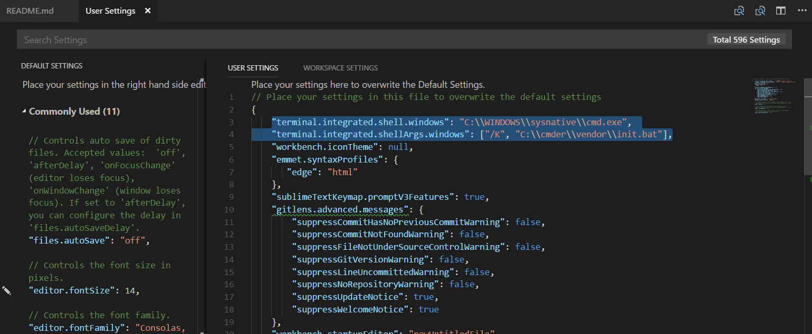

## Instructrions
- Open File > Preferences > Setting
- Paste this line to the **User Settings**
  ```json
  "terminal.integrated.shell.windows": "C:\\WINDOWS\\sysnative\\cmd.exe",
  "terminal.integrated.shellArgs.windows" : ["/K","C:\\cmder\\vendor\\init.bat"]
  ```

\